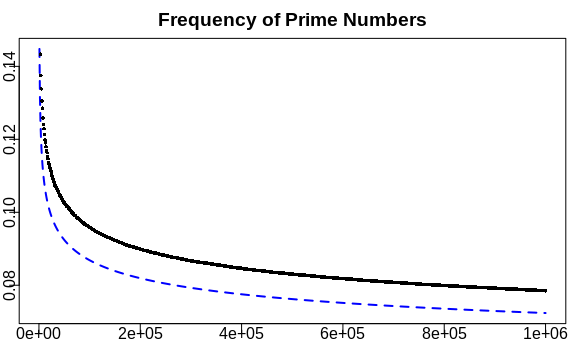

# Create Ulam Spirals

## Fermat's primality test

Pick a random number $a$. Fermats little theorem states that if the following equation holds, $p$ is a prime number:

$a^(p-1) \mod p = 1$

If the equation does not hold, p is certainly no prime number. If the equation holds, p is a prime number, except if a is a fermat liar.

Suppose we wish to determine whether n = 221 is prime. Randomly pick 1 < a < 221, say a = 38. We check the above equality and find that it holds:

$a^{n-1}=38^{220}$ 1{\pmod {221}}.} 
$$a^{{n-1}}=38^{{220}}\equiv 1{\pmod  {221}}.
Either 221 is prime, or 38 is a Fermat liar, so we take another a, say 24:

{\displaystyle a^{n-1}=24^{220}\equiv 81\not \equiv 1{\pmod {221}}.} a^{{n-1}}=24^{{220}}\equiv 81\not \equiv 1{\pmod  {221}}.
So 221 is composite and 38 was indeed a Fermat liar. Furthermore, 24 is a Fermat witness for the compositeness of 221